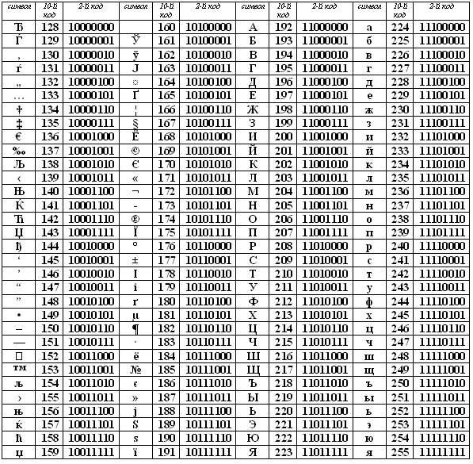

# Занятия кружка по программированию в 6мл классе ЮМШ. 2020-2021

Преподаватель: Борис Юрьевич Пичугин

---

- [Как работает компьютер](#как-работает-компьютер)
  - [Домашнее задание](#домашнее-задание)
- [Информация](#информация)
  - [Задача про угадывание числа](#задача-про-угадывание-числа)
  - [Задача про поиск фальшивой монеты](#задача-про-поиск-фальшивой-монеты)
  - [Измерение количества информации](#измерение-количества-информации)
  - [Измерение скорости передачи данных](#измерение-скорости-передачи-данных)
- [Кодирование сообщений](#кодирование-сообщений)
  - [Кодирование текста](#кодирование-текста)
    - [ASCII](#ascii)
    - [CP-1251](#cp-1251)
    - [Unicode](#unicode)
  - [Кодирование изображений](#кодирование-изображений)
  - [Кодирование звука](#кодирование-звука)
    - [MIDI](#midi)
    - [Импульсно-кодовая модуляция](#импульсно-кодовая-модуляция)
- [Файловая система](#файловая-система)
  - [Файл](#файл)
  - [Именование файлов](#именование-файлов)
  - [Файловая система](#файловая-система-1)
    - [Распространённые файловые системы](#распространённые-файловые-системы)
  - [Содержимое файла (область данных)](#содержимое-файла-область-данных)
- [Файловая система](#файловая-система-2)
  - [Интерпретация содержимого](#интерпретация-содержимого)
    - [По расширению](#по-расширению)
    - [По содержимому](#по-содержимому)
    - [Атрибуты файла в Linux](#атрибуты-файла-в-linux)
  - [Задания](#задания)
- [Создание файла и папки разными способами](#создание-файла-и-папки-разными-способами)
- [Программа "Hello, World!" на разных языках](#программа-hello-world-на-разных-языках)
  - [Машинно-ориентированные языки](#машинно-ориентированные-языки)
    - [Перфокарта](#перфокарта)
    - [Бинарный файл программы (бинарный код)](#бинарный-файл-программы-бинарный-код)
    - [Assembler, x86, DOS](#assembler-x86-dos)
  - [Компилируемые языки](#компилируемые-языки)
    - [C](#c)
    - [C++](#c-1)
    - [Pascal](#pascal)
  - [Языки, компилируемые в байт-код](#языки-компилируемые-в-байт-код)
    - [Java](#java)
    - [Kotlin](#kotlin)
    - [Scala](#scala)
  - [Скриптовые языки](#скриптовые-языки)
    - [BASIC](#basic)
    - [Python](#python)
    - [JavaScript](#javascript)
    - [Bash](#bash)
- [Переменные](#переменные)
  - [Две концепции понятия переменная](#две-концепции-понятия-переменная)
  - [Ссылочные переменные](#ссылочные-переменные)
  - [Встроенные типы переменных Python](#встроенные-типы-переменных-python)
  - [`None` — неопределенное значение](#none--неопределенное-значение)
  - [`bool` — логический тип](#bool--логический-тип)

---

## Как работает компьютер

- Музыкальная шкатулка как простой пример компьютера и программы.

- Что происходит при включении компьютера. Загрузка BIOS и OS.

- Машина Тьюринга [wiki](https://ru.wikipedia.org/wiki/%D0%9C%D0%B0%D1%88%D0%B8%D0%BD%D0%B0_%D0%A2%D1%8C%D1%8E%D1%80%D0%B8%D0%BD%D0%B3%D0%B0).

- Простая программа для машины Тьюринга, которая заменяет все символы на обратные.

- Программа для машины Тьюринга, которая вставляет запятую между словами.

---

### Домашнее задание

Написать программу для машины Тьюринга.

- **Вход.** На ленте написано выражение вида `111+11=`, каретка стоит над первым символом выражения.

- **Выход.** После остановки на ленте после знака равенства должна быть написана сумма слагаемых в унарной системе счисления: `111+11=11111`, каретка на первом пустом символе после конца выражения.

---

## Информация

---

### Задача про угадывание числа

### Задача про поиск фальшивой монеты

---

### Измерение количества информации

**Бит** (`bit`, `b`) — это минимальная (неделимая) единица хранения информации. Может принимать всего два значения `0` (`false`) и `1` (`true`).

--

Из соображений скорости, центральный процессор не умеет работать с отдельными битами. Ему обязательно надо работать с несколькими битами стразу. Исторически первые более-менее массовые процессоры умели оперировать с `8` битами за такт.

**Байт** (октет, Byte, `B`) — это последовательность из `8` бит. Например, `11011011`. Всего таких последовательностей 2<sup>8</sup> = `256`. Это числа от `0` до `255`, записанные в двоичной системе.

На письме bit обозначают маленькой буквой `b` или явно пишут `bit`, а Byte — большой `B`.

---

- 1 байт (`B`) = 8 бит (`bit`)

- 1 килобайт (`Кб`, `KB`, `KiB`) = 1024 `B` = 2<sup>10</sup> `B`

- 1 мегабайт (`Мб`, `MB`, `MiB`) = 1024 `KB` = 2<sup>20</sup> `B`

- 1 гигабайт (`Гб`, `GB`, `GiB`) = 1024 `MB` = 2<sup>30</sup> `B`

- 1 терабайт (`Тб`, `TB`, `TiB`) = 1024 `GB` = 2<sup>40</sup> `B`

--

- 1 Слово (`WORD`) = 2 `B` = 16`bit`.

- 1 Двойное слово (`DWORD`) = 4 `B` = 32`bit`.

- 1 Четверное слово (`QWORD`, `long int`) = 8 `B` = 64`bit`.

---

### Измерение скорости передачи данных

- 1 килобит в секунду (`кбит/с`, `kbps`, `kbit/s`, `kb/s`) = 1000 `bit/sec` (`bits per second`, `b/s`).

- 1 мегабит в секунду (`Мбит/с`, `Mbps`, `Mbit/s`, `Mb/s`) = 1000 `kbit/s`

- 1 гигабит в секунду (`Гбит/с`, `Gbps`, `Gbit/s`, `Gb/s`) = 1000 `Mbit/s`

---

## Кодирование сообщений

---

### Кодирование текста

Текст — это сообщение, содержащее последовательность символов.

--

Самый простой (казалось бы) способ превратить последовательность символов в последовательность `0` и `1` — это каждому символу сопоставить свой набор нулей и единиц.

--

Например, символу `A` можно сопоставить `01000001`.

--

Проблема: тот, кто декодирует сообщение из бинарной последовательности в последовательность символов должен знать какие бинарные кусочки каким символам сопоставлены.

Так появились стандарты кодировки.

---

#### ASCII


---

#### CP-1251



---

#### Unicode

Юнико́д (англ. Unicode) — стандарт кодирования символов, включающий в себя знаки почти всех письменных языков мира.

- `Unicode` (1991г) — ровно `2` байта на символ, `65 536` символов.

- `UTF-8` (1992г) — от `1` до `4` байт (до 6 байт) на символ, `2 164 864` символов, но используются не все.

- `Unicode` (1996г), `UTF-16` — `2` или `4` байта на символ, `1 112 064` символов. Стандарт.

- `UTF-32` — ровно четыре байта на символ, `4 294 967 296` символов, но используются не все.

---

### Кодирование изображений

--

Чтобы закодировать изображение, его разрезают на маленькие квадратики — пиксели.


--

Если изображение чёрно-белое, то после разрезания на пиксели его сразу можно превратить в последовательность нулей и единиц.

---

Цветные изображения, тоже сначала режут на пиксели.


--

Для кодировки цвета символа используют три числа `(R, G, B)`:
- `R` — интенсивность свечения красного,
- `G` — интенсивность свечения зелёного,
- `B` — интенсивность свечения синего (голубого).

|                                                                                                      |                                                                                                      |                                                                                                      |                                                                                                        |                                                                                                        |                                                                                                          |
| ---------------------------------------------------------------------------------------------------- | ---------------------------------------------------------------------------------------------------- | ---------------------------------------------------------------------------------------------------- | ------------------------------------------------------------------------------------------------------ | ------------------------------------------------------------------------------------------------------ | -------------------------------------------------------------------------------------------------------- |
| <div style="width:20px;height:20px;border:0px;solid #000;background-color:RGB(255,0,0)">&nbsp;</div> | <div style="width:20px;height:20px;border:0px;solid #000;background-color:RGB(0,255,0)">&nbsp;</div> | <div style="width:20px;height:20px;border:0px;solid #000;background-color:RGB(0,0,255)">&nbsp;</div> | <div style="width:20px;height:20px;border:0px;solid #000;background-color:RGB(255,255,0)">&nbsp;</div> | <div style="width:20px;height:20px;border:0px;solid #000;background-color:RGB(100,100,0)">&nbsp;</div> | <div style="width:20px;height:20px;border:0px;solid #000;background-color:RGB(116,123,142)">&nbsp;</div> |
| (255, 0, 0)                                                                                          | (0, 255, 0)                                                                                          | (0, 0, 255)                                                                                          | (255, 255, 0)                                                                                          | (100, 100, 0)                                                                                          | (116, 123, 142)                                                                                          |

---

Для того, чтобы отобразить пиксель на экране его еще разрезают на субпиксели


---

### Кодирование звука

#### MIDI

Грубо. Звуковое сообщение представляется в виде нотной записи и кодируется как последовательность символов в специальной кодировке.

MIDI позволяет кодировать такие данные как нажатие клавиш, настройку громкости и других акустических параметров, выбор тембра, темпа, тональности и др., с точной привязкой во времени.

--

Годится только для музыкальных композиций, но является абсолютно точным.

---

#### Импульсно-кодовая модуляция

Звук можно охарактеризовать **частотой** колебания мембраны и **амплитудой** (размахом) этого колебания.

--

Если эти параметры меняются со временем, то мы слышим музыку, речь, ...

--


---

## Файловая система

---

### Файл

**Файл** (англ. *file*) — именованная область данных на носителе информации.

--

- именованная

--

- область данных

--

- на носителе информации.

--

Свойства файлов, правила именования и места их размещения, вообще говоря, зависят от операционной системы, но есть общие черты.

---

### Именование файлов

**Полное имя файла** — последовательность символов однозначно идентифицирующая файл. Например:

- Linux/MacOS: `/home/boris/Документы/ЮМШ/2020-2021/Кружок/lessons.md`

- Windows: `D:\Документы\ЮМШ\2020-2021\Кружок\lessons.md`

---

Для удобства каталогизации люди придумали раскладывать файлы по каталогам, а каталоги по каталогам. Поэтому полное имя файла содержит разделители `\` или `/`. Эти разделители отделяют имена родительских каталогов:

Файл `/home/boris/Документы/ЮМШ/2020-2021/Кружок/lessons.md`

лежит в каталоге `/home/boris/Документы/ЮМШ/2020-2021/Кружок`,

который лежит в каталоге `/home/boris/Документы/ЮМШ/2020-2021` и так далее.

---

**Имя файла** — часть *полного имени файла* после последнего разделителя каталогов. Например, `lessons.md`.

--

**Расширение файла** — часть *имени файла* после последней точки если есть. Например, `md`. Обычно расширение файла указывает на то, какого рода данные записаны в файле.

---

### Файловая система

**Файловая система** — это область данных, в которой в понятном для OS формате записан реестр всех файлов.

--

Для каждого файла записаны:

- его свойства (имя, права доступа, дата создания и изменения, ...)

- расположение его фрагментов на носителе информации.

--

Кроме того, файловая система — это набор соглашений о том, что можно, чего нельзя, и как можно работать с файлами.

---

#### Распространённые файловые системы

- Windows: `FAT` (`FAT16`), `FAT32`, `NTFS`.

- Linux: `ext`, `ext2`, `ext3`, `ext4`, `zfs`, ...

---

### Содержимое файла (область данных)

**Содержимое файла** — это всегда просто последовательность байт некоторой длины, которая кодирует некоторое сообщение некоторым известным способом.

--

**Размер файла** — это число байт в файле (длина последовательности).

---

## Файловая система

---

### Интерпретация содержимого

#### По расширению

- Текстовые файлы (.txt, .log, .csv, .md, .tex, .py, .js, ...)

- Документы (.doc, .docx, .odt, .xls, .pdf, ...)

- Изображения (.jpg, .png, .svg, ...)

- Программы (.exe, ...)

---

#### По содержимому

Можно начать читать байты файла и пытаться увидеть в них какой-нибудь смысл. Например, большинство изображений и музыкальных файлов можно распознать прочитав несколько первых байт файла.

---

#### Атрибуты файла в Linux


---


---

### Задания

- Создать папку для файлов с именем `Test`.

- Создать папку для файлов с именем `Test2`.

- В папке `Test` создать файл `hw.txt`, в который записать сообщение `Hello World!`.

- Переименовать файл `hw.txt` в `hw2.txt`.

- Скопировать файл `hw2.txt` из папки `Test` в папку `Test2`.

---

## Создание файла и папки разными способами

---

## Программа "Hello, World!" на разных языках

<https://vscode.ru/articles/hello-world-na-raznyh-yazykah-programmirovaniya.html>

---

### Машинно-ориентированные языки

---

#### Перфокарта


(!) По приблизительным подсчётам, гигабайт информации, представленной в виде перфокарт, имел бы массу примерно 22 тонны.

---

#### Бинарный файл программы (бинарный код)


---

#### Assembler, x86, DOS

```asm
.MODEL SMALL
.STACK 100h
.DATA
    HelloMessage DB 'Hello World',13,10,'$'
.CODE
START:
    mov ax,@data
    mov ds,ax
    mov ah,9
    mov dx,OFFSET HelloMessage
    int 21h
    mov ah,4ch
    int 21h
END START
```

---

### Компилируемые языки

--

#### C

```c
#include <stdio.h>

int main()
{
  printf("Hello, World!\n");
  return 0;
}
```

--

#### C++

```C++
#include <iostream>
using namespace std;

int main()
{
    cout << "Hello, World!";
    return 0;
}
```

--

#### Pascal

R.I.P.

---

### Языки, компилируемые в байт-код

--

#### Java

```Java
package demo

public class HelloWorld {
    public static void main(String[] args) {
        System.out.println("Hello, World!");
    }
}
```

--

#### Kotlin

```Kotlin
package demo

fun main() {
  println("Hello, world!")
}
```

--

#### Scala

```Scala
object HelloWorld {
  def main(args: Array[String]): Unit = {
    println("Hello, World!")
  }
}
```

---

### Скриптовые языки

--

#### BASIC

```Basic
PRINT "HELLO WORLD"
```

--

#### Python

```Python
print("Hello, world!")
```

--

#### JavaScript

```JavaScript
console.log("Hello, world!")
```

--

#### Bash

```Bash
echo "HELLO WORLD"
```

---

## Переменные

Программа обрабатывает данные, то есть совершает операции над данными. Последовательность этих операций это **программа**.

--

Для обозначения фрагментов данных, с которыми надо выполнить операции, придумали **переменные**.

---

### Две концепции понятия переменная

Существует две концепции к реализации переменных в языках программирования.

Языки `Python`, `Java`, `JavaScript`, `Kotlin`, `Scala`, ... используют концепцию **ссылочных переменных**.

Ссылочная переменная — это ссылка на фрагмент памяти, в котором записаны данные.

--

Языки `С`, `С++`, `Assembler` используют концепцию **переменных по значению**.

Переменная по значению — это сам фрагмент памяти, в котором записаны данные.

---

### Ссылочные переменные

**(Ссылочная) переменная** — это ссылка (ярлык, бирка) на фрагмент памяти, у которого есть **имя** и **тип**.

**Имя переменной** используется для того, чтобы указать на требуемый фрагмент памяти.

**Тип переменной** используется для того, чтобы указать какие операции можно выполнять с этим фрагментом памяти.

---

```Python
name = "Boris Pichugin"
```

Выделить фрагмент памяти и записать в него байты, кодирующие сообщение `Boris Pichugin` (примерно 18 байт).

Создать ярлык `name` типа `str` (строка) и нацелить его на этот фрагмент памяти.

`Python` сам догадывается какой тип у создаваемой переменной.

---

```Python
name = "Boris Pichugin"
teacher = name
```

Создать ярлык `teacher` того же типа, что и ярлык `name` (т.е. `str`) и нацелить его на тот же фрагмент памяти, куда направлен ярлык `name`.

---

```Python
name = "Boris Pichugin"
teacher = name
name = "Anna Pichugina"
```

Переменные `name` и `teacher` теперь ссылаются на разные фрагменты памяти.

Ярлыки можно перенаправлять.

---

```Python
name = "Boris Pichugin"
teacher = name
name = "Anna Pichugina"
teacher = name
```

Теперь фрагмент памяти, в котором записана строка `"Boris Pichugin"`, больше никому не нужен, так как на него никто не ссылается.

Такие фрагменты памяти называются **мусором** (**garbage**) и автоматически освобождаются при помощи встроенного **сборщика мусора** (**garbage collector**).

---

Ещё пример

```Python
a = 2
b = 5
c = a * b
print(a)
print(c)

a = "Привет!"
print(a)
```

---

### Встроенные типы переменных Python

Нужные типы

- `None` — неопределенное значение;
- `bool` — логический тип: `True` или `False`;
- `str` — строка;

---

Числа

- `int` — целое число;
- `float` — число с плавающей точкой;
- `complex` — комплексное число;

---

Коллекции

- `list` — список;
- `tuple` — кортеж;
- `range` — диапазон;
- `generator` — генератор;
- `set` — множество;
- `frozenset` — неизменяемое множество;
- `dict` — словарь;

---

Бинарные списки

- `bytes` — строка байт;
- `bytearray` — массив байт;
- `memoryview` — специальные объекты для доступа к внутренним данным объекта через `protocol buffer`.

---

### `None` — неопределенное значение

Этим типом обладают те переменные, которые не указывают ни на какой фрагмент памяти.

```Python
a = None
```

---

### `bool` — логический тип

Переменные этого типа принимают только два значения: `True` и `False`. Используются в условных операторах `if`, `elif`, `while`.

Логическое значение можно получить как результат сравнения:

```Python
X == Y  # = True <=> X и Y указывают на равные фрагменты данных;
X != Y

X < Y
X > Y
X <= Y
X >= Y
X < Y < Z
```

Строки и списки сравниваются лексикографически.

---

Логическое значение можно получить как результат логической операции:

```Python
X and Y  # = True <=> X и Y интерпретируются как истина;

X or Y   # = True <=> X или Y интерпретируются как истина;

not X    # = True <=> X интерпретируются как ложь;
```

---

Интерпретация (конвертация) переменных разных типов в тип `bool`:

`True`

- непустая строка;
- любое число, не равное `0`;
- непустая коллекция.

`False`

- `None`;
- пустая строка;
- число, равное `0`;
- пустая коллекция.

