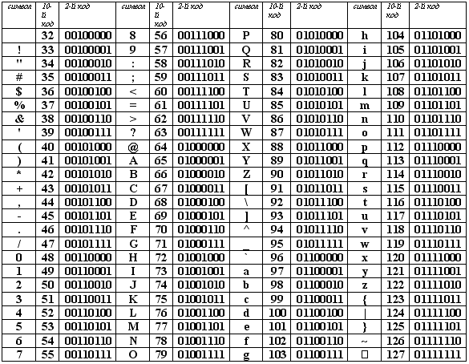

# Занятия по информатике в 8мл классе ЮМШ. 2022-2023

Преподаватель: Борис Юрьевич Пичугин

---

- [Позиционная система счисления](#позиционная-система-счисления)
  - [2022.09.10 Позиционная система счисления](#20220910-позиционная-система-счисления)
  - [2022.09.17 Позиционная система счисления](#20220917-позиционная-система-счисления)
  - [2022.09.24 Позиционная система счисления](#20220924-позиционная-система-счисления)
  - [2022.10.01 Позиционная система счисления](#20221001-позиционная-система-счисления)
  - [2022.10.08 Быстрый перевод между системами счисления](#20221008-быстрый-перевод-между-системами-счисления)
  - [2022.10.15 Позиционная система счисления](#20221015-позиционная-система-счисления)
- [Информация](#информация)
  - [2022.10.22 Информация](#20221022-информация)
  - [2022.10.29 Самостоятельная работа](#20221029-самостоятельная-работа)
  - [2022.11.12 Измерение информации](#20221112-измерение-информации)
  - [2022.12.03 Кодирование целых чисел](#20221203-кодирование-целых-чисел)
  - [2022.12.10 Числа с плавающей запятой](#20221210-числа-с-плавающей-запятой)
  - [2022.12.17 Числа с плавающей запятой (точность и специальные значения)](#20221217-числа-с-плавающей-запятой-точность-и-специальные-значения)
  - [2022.12.24 Кодирование текста](#20221224-кодирование-текста)
  - [2023.01.13 Кодировки текстовых файлов](#20230113-кодировки-текстовых-файлов)

---

## Позиционная система счисления

### 2022.09.10 Позиционная система счисления

**Определениею.** Пусть $q\in\mathbb{N}$, $a\in\mathbb{R}$. Представление

$$a=\pm(d_n q^n+\dots+d_0 q^0+d_{-1} q^{-1}+d_{-2} q^{-2}+\dots+d_{-k} q^{-k}+\dots),$$

где $d_i\in\{0,1,\dots,q-1\}$, называется **записью числа $a$ в позиционной системе счисления с основанием $q$**.

Числа $d_i$ называются **цифрами** числа $a$. Для записи цифр используют символы из последовательности: $\text{0, 1, 2, 3, 4, 5, 6, 7, 8, 9, A, B, C, D, E, F}, \dots$.

Коротко записывают так:

$$a=\pm\overline{d_n\dots{}d_0{,}d_{-1}d_{-2}\dots d_{-k}\dots}_q$$

Примеры записи:

$$123{,}345_7=1\cdot7^2+2\cdot7^1+3\cdot7^0+3\cdot7^{-1}+4\cdot7^{-2}+5\cdot7^{-3},$$

$$\text{AB2}{,}\text{FE}_{16}=10\cdot16^2+11\cdot16^1+2\cdot16^0+15\cdot16^{-1}+14\cdot16^{-2}.$$

Свойства чисел такие как делимость, сравнимость, рациональность, иррациональность, больше, меньше, равенство, и т.п. никак не зависят от способа записи числа.

#### Задачи

1. Переведите число $123_{10}$ в пятиричную систему счисления.

2. Переведите число $123{,}45_{10}$ в пятиричную систему счисления.

3. Сформулируйте признак делимости на $q^n$ в системе счисления с основанием $q$.

4. Пусть $q\equiv_m 1$. Сформулируйте признак делимости на $m$ в системе счисления с основанием $q$.

5. Пусть $q\equiv_m -1$. Сформулируйте признак делимости на $m$ в системе счисления с основанием $q$.

#### Домашнее задание

Срок сдачи: 2022.09.17 11:45.

1. Переведите число $557{,}12_{10}$ в двоичную, троичную, шестиричную и шестнадцатиричную системы счисления. Обратите внимание, что во всех четырёх системах счисления вы получите периодическую дробь. Ваша задача найти этот период.

### 2022.09.17 Позиционная система счисления

#### Задачи

1. Переведите число $274_{10}$ в семиричную систему счисления.

2. Переведите число $-274{,}45_{10}$ в семиричную систему счисления.

3. Докажите, что конечная десятичная дробь всегда будет периодической в системе счисления $q$, если $q$ взаимно просто с $10$.

4. Вычислите $254_{7} + 6654_{7}$, $204_{5} \cdot 441_{5}$, $345_{6} / 10_{6}$, $345_{6} / 15_{6}$.

5. Вычислите $204_{5} + 333_{10}$.

6. Напишите программу перевода данного целого числа из десятичной системы счисления в систему счисления с данным основанием $q$.
   [Решение](2022-09-17/6.v1.py), [ещё одно решение](2022-09-17/6.v2.py).

7. Напишите программу, которая последовательно печатает на экране первых $100$ натуральных чисел в системе счисления с данным основанием $q$.

#### Домашнее задание

Для успешной сдачи этого домашнего задания нужно решить не менее одной задачи из списка.

Срок сдачи: 2022.10.01 11:45.

1. Напишите программу, которая печатает 100 цифр после запятой данного числа $a\in[0;1)$ в системе счисления с данным основанием. Дробные числа в памяти компьютера записываются в двоичной системе счисления с фиксированным числом знаков после запятой. Поэтому все дробные числа, двоичная запись которых является бесконечной дробью, хранятся в памяти не точно (и, к сожалению, не только они). Например, число $0{,}3$ в двоичной системе является периодической дробью, и, значит, не может быть записано в память точно. Так вот. Чтобы точно выписать все цифры данного числа $a$ в нужной системе счисления у пользователя надо спросить два целых числа $b$ и $p$ и считать, что $a = \frac{b}{10^p}$, а все вычисления проводить только в целых числах. Например, для перевода числа $0{,}0015$ пользователь должен будет ввести $b = 15$ и $p=4$.

[Решение](2022-09-17/hw.1.py).

2. (*) Модифицировать программу 1 так, чтобы программа находила период дроби, если он есть. Например, число $0{,}25$ в двоичной системе счисления является конечной дробью $0{,}01_2$, а в троичной системе счисления периодической $0{,}(02)_3$. Поэтому в первом случае программа должна напечатать `0.01_2`, а во втором - `0.(02)_3`.

[Решение](2022-09-17/hw.2.py).

### 2022.09.24 Позиционная система счисления

#### Задачи

1. Напишите функцию преобразования строки в целое число. Данная строка представляет собой последовательность цифр целого числа, записанного в позиционной системе счисления с данным основанием $q$. Для получения значения цифры из её символа можно воспользоваться функцией `char_to_digit`.

```Python
def str_to_int(a: str, q: int) -> int:
    # Ваш код тут

def char_to_digit(ch: str) -> int:
    if '0' <= ch <= '9':
        return ord(ch) - ord('0')
    if 'A' <= ch <= 'Z':
        return ord(ch) - ord('A') + 10
    if 'a' <= ch <= 'z':
        return ord(ch) - ord('a') + 10
    raise Exception(f"Символ {ch} не является цифрой.")
```

[Решение](2022-09-24/1.py).

2. Напишите функцию преобразования строки в действительное число. Данная строка представляет собой последовательность цифр действительного числа, записанного в позиционной системе счисления с данным основанием $q$.

```Python
def str_to_float(a: str, q:int) -> float:
    # Ваш код тут

def char_to_digit(ch: str) -> int:
    if '0' <= ch <= '9':
        return ord(ch) - ord('0')
    if 'A' <= ch <= 'Z':
        return ord(ch) - ord('A') + 10
    if 'a' <= ch <= 'z':
        return ord(ch) - ord('a') + 10
    raise Exception(f"Символ {ch} не является цифрой.")
```

[Решение](2022-09-24/2.py).

### 2022.10.01 Позиционная система счисления

#### Задачи

1. Напишите функцию сложения двух целых чисел в позиционной системе счисления с данным основанием. В функцию каждое слагаемое передаётся в виде строки, состоящей из цифр числа. Результат также следует представить в виде строки, состоящей из цифр числа.

```Python
def add(a: str, b: str, q: int) -> str:
    # Ваш код тут
```

2. (*) Напишите функцию умножения двух целых чисел в позиционной системе счисления с данным основанием. В функцию каждое слагаемое передаётся в виде строки, состоящей из цифр числа. Результат также следует представить в виде строки, состоящей из цифр числа.

```Python
def multiply(a: str, b: str, q: int) -> str:
    # Ваш код тут
```

#### Домашнее задание

Срок сдачи: 2022.10.08 11:45.

**Замечание.** Если вы уже сдали эту задачу в классе, то всё равно пришлите мне письмо с правильным заголовком, в котором укажите, что сдали сложение столбиком в классе.

1. Напишите функцию сложения двух целых чисел в позиционной системе счисления с данным основанием, **используя алгоритм сложения чисел в столбик**. В функцию каждое слагаемое передаётся в виде строки, состоящей из цифр числа. Результат также следует представить в виде строки, состоящей из цифр числа.

```Python
def add(a: str, b: str, q: int) -> str:
    # Ваш код тут

def char_to_digit(ch: str) -> int:
    if '0' <= ch <= '9':
        return ord(ch) - ord('0')
    if 'A' <= ch <= 'Z':
        return ord(ch) - ord('A') + 10
    if 'a' <= ch <= 'z':
        return ord(ch) - ord('a') + 10


print(add("101", "11", 2))
print(add("12376", "1177", 8))
print(add("FFFF", "123456789", 16))
```

Программа должна вывести на экран:

```Text
111
13575
123466788
```

[Простое решение](2022-10-01/hw.1.py), [более полное решение](2022-10-01/hw.2.py).

### 2022.10.08 Быстрый перевод между системами счисления

Двоично-шестнадцатиричная таблица

| 2 | 16 | | 2 | 16 |
| --- | --- | --- | --- | --- |
| 0000 | 0 | | 1000 | 8 |
| 0001 | 1 | | 1001 | 9 |
| 0010 | 2 | | 1010 | A |
| 0011 | 3 | | 1011 | B |
| 0100 | 4 | | 1100 | C |
| 0101 | 5 | | 1101 | D |
| 0110 | 6 | | 1110 | E |
| 0111 | 7 | | 1111 | F |

#### Задачи

1. Составьте таблицы быстрого двоично-четверичного и двоично-восьмиричного перевода.

2. Переведите в восьмиричную и шестнадцатиричную системы счисления:
   - $1010101_2$
   - $-110111010111_2$
   - $1100110,111010111_2$

3. Переведите в двоичную и шестнадцатиричную системы счисления:
   - $40011_8$
   - $-533,202_8$

4. Переведите в двоичную и восьмиричную системы счисления:
   - $-\text{ABF0}_{16}$
   - $\text{D2,1E}_{16}$

#### Домашнее задание

Срок сдачи: 2022.10.22 10:45 (две недели).

1. Напишите функцию перевода числа, записанного в виде строки, из двоичной в восьмиричную систему счисления.

```Python
def bin_to_oct(a: str) -> str:
    """
    :param a: строка, содержащая цифры данного числа в двоичной системе счисления.
    :return: строка, содержащая цифры данного числа в восьмиричной системе счисления.
    """
    # Ваш код тут


print(bin_to_oct("101"))
print(bin_to_oct("110101"))
print(bin_to_oct("11"))
print(bin_to_oct("10110101"))

# (*) Для шибко-грамотных
print(bin_to_oct("-10110101"))
print(bin_to_oct("-1011.0101"))
```

Программа должна напечатать

```Text
5
65
3
265
-265
-13.24
```

**Указание 1.** Чтобы вырезать из строки `str` фрагмент от символа с номером `i` (включительно) до символа с номером `j` (не включительно) следует написать `str[i:j]`. Например,

```Python
s = "abcdefgh"
u = s[1:5]
```

после выполнения этого кода в переменной `u` будет записана ссылка на строку `"bcde"`.

**Указание 2.** В своей программе вы можете использовать следующий словарь:

```Python
BIN_TO_OCT = {
    "0":   "0",
    "00":  "0",
    "000": "0",
    "1":   "1",
    "01":  "1",
    "001": "1",
    "10":  "2",
    "010": "2",
    "11":  "3",
    "011": "3",
    "100": "4",
    "101": "5",
    "110": "6",
    "111": "7"
}
```

для того, чтобы получить восьмиричную цифру для комбинации двоичных цифр `"101"` нужно написать

```Python
d = BIN_TO_OCT["101"]
```

2. (*) По аналогии с предыдущей программой написать функции `bin_to_hex`, `oct_to_bin`, `hex_to_bin`.

### 2022.10.15 Позиционная система счисления

#### Самостоятельная работа

#### Задачи

1. Может ли быть верным равенство $7 + 8 = 16$?

2. В саду $100_q$ деревьев --- $14_q$ яблонь и $42_q$ груши. Найдите $q$.

3. Найдите наименьшее основание системы счисления $q$ и цифры $m$ и $n$ такие, что $$33m5n_q + 2n443_q = 55424_q,$$ если $m$ --- максимальная цифра в этой системе.

4. Подберите основание системы счисления $q$ и решите ребус $24{*}{*}1_q + {*}235{*}_q = 116678_q$.

5. Найдите такое $q$, что $756_q + 307_q + 2456_q + 24_q = 3767_q$.

6. Найдите такое $q$, что $213_q \cdot 3_q = 1144_q$.

## Информация

### 2022.10.22 Информация

#### Понятие о информации

**Информация** (от лат. *informātiō* «разъяснение, представление, понятие о чём-либо» ← *informare* «придавать вид, форму, обучать; мыслить, воображать») — сведения независимо от формы их представления ([подробнее на Википедии](https://ru.wikipedia.org/wiki/Информация)).

**Язык** — это определённая знаковая система представления информации.

**Сообщение** — это конкретные сведения (конкретная информация), выраженная в некотором языке.

Некоторые языки обладают **алфавитом**. Алфавит — это набор знаков (символов), используемый в языке для представления информации.

#### Кодирование информации

**Кодирование информации** — это процесс преобразования сообщения из одного языка в другой.

Пусть сообщение `M` представлено в языке `A`, а сообщение `N` это результат кодирования сообщения `M` в языке `B`. Если сообщение `M` можно полностью восстановить по сообщению `N`, то говорят, что кодирование сообщения `M` в сообщение `N` было проведено **без потери информации**. В противном случае говорят о кодировании **с потерей информации**.

#### Азбука Морзе


### 2022.10.29 Самостоятельная работа

#### Задание на 4

**Шифр Цезаря**. Этот шифр кодирует (шифрует) сообщение, записанное в некотором письменном языке, по следующему правилу: каждая буква исходного сообщения заменяется идущей после неё с некоторым фиксированным сдвигом буквой в "алфавите", который считается написанным по кругу. Цезарь считал, что "алфавит" содержит только буквы, и не содержит знаков препинания, поэтому остальные символы сообщения (пробелы, запятые и т.п.) остаются без изменения.

Напишите программу, которая шифрует сообщения русского письменного языка шифром Цезаря. У пользователя следует спросить величину смещения и текст сообщения.

Требования.

- Программа должна напечатать своё краткое описание.
- Перед запросом данных, программа должна напечатать какие данные она запрашивает.
- Алгоритм шифрования должен быть оформлен в виде функции, которая принимает на вход величину сдвига как целое число и текст сообщения как строку, а возвращает зашифрованное сообщение как строку.
- Программа должна шифровать буквы как в нижнем регистре (прописные), так и в верхнем (заглавные).
- При написании программы можно пользоваться интернетом и читать все программы, опубликованные на гитхабе.
- Нельзя пользоваться помощью соседа.

Замечание.

К сожалению, буквы русского алфавита расположены в кодовой таблице не подряд: буква `ё` имеет особенный код. Поэтому для определения номера, например, буквы `ф` в алфавите русского языка некорректно будет использовать выражение `ord('ф') - ord('а')`. Для определения номера буквы в русском алфавите следует использовать код вроде следующего:

```Python
ALPHABET_LOW = "абвгдеёжзийклмнопрстуфхцчшщъыьэюя"
code = ALPHABET_LOW.find('ф')
```

функция `find` вернёт индекс (номер, считая от 0) данного символа в строке `ALPHABET_LOW` или `-1`, если данный символ в строке не содержится.

[Решение](2022-10-29/caesar.py).

#### Задание на 5

**Шифр Виженера**. Этот шифр кодирует (шифрует) сообщение, записанное в некотором письменном языке, по следующему правилу: каждая буква исходного сообщения заменяется идущей после неё с некоторым сдвигом буквой в "алфавите", который считается написанным по кругу. Величину сдвига задают ключевым словом: например, слово `ВАЗА` задаёт последовательность сдвигов: `3`, `1`, `9`, `1`, `3`, `1`, `9`, `1`, и т.д. Виженер считал, что "алфавит" содержит только буквы, и не содержит знаков препинания, поэтому остальные символы сообщения (пробелы, запятые и т.п.) остаются без изменения.

Напишите программу, которая шифрует сообщения русского письменного языка шифром Виженера. У пользователя следует спросить кодовое слово и текст сообщения. Регистр буквы в кодовом слове не имеет значения.

Требования.

- Программа должна напечатать своё краткое описание.
- Перед запросом данных, программа должна напечатать какие данные она запрашивает.
- Алгоритм шифрования должен быть оформлен в виде функции, которая принимает на вход кодовое слово как строку и текст сообщения как строку, а возвращает зашифрованное сообщение как строку.
- Программа должна шифровать буквы как в нижнем регистре (прописные), так и в верхнем (заглавные).
- При написании программы можно пользоваться интернетом и читать все программы, опубликованные на гитхабе.
- Нельзя пользоваться помощью соседа.

Замечание.

К сожалению, буквы русского алфавита расположены в кодовой таблице не подряд: буква `ё` имеет особенный код. Поэтому определять номер, например, буквы `ф` в алфавите русского языка выражением `ord('ф') - ord('а')` будет некорректно, хотя это выражение замечательно работает для английского языка. Для определения номера буквы в русском алфавите следует использовать код вроде следующего:

```Python
ALPHABET_LOW = "абвгдеёжзийклмнопрстуфхцчшщъыьэюя"
code = ALPHABET_LOW.find('ф')
```

функция `find` вернёт индекс (номер, считая от 0) данного символа в строке `ALPHABET_LOW` или `-1`, если данный символ в строке не содержится.

[Решение](2022-10-29/vigenere.py).

### 2022.11.12 Измерение информации

#### Измерение сообщений

**Длинной** или **размером** сообщения, представленном в некотором языке, называется число символов, использованных для кодирования этого сообщения в данном языке.

Например, для книга Толстого "Война и Мир", закодированная в письменном русско-французском языке, занимает 1476031 символа.

Для текстов такая единица измерения не очень удобна в быту. Поэтому люди навыдумывали всякие более крупные единицы измерения. Например, страница: книга Толстого "Война и Мир", занимает 960 страниц. В типографиях используют единицу измерения **(условный) печатный лист** — это количество текста, которое помещается на одну сторону типографского бумажного листа (16 листов формата A4). Обе эти единицы измерения не точные, так как зависят от формата текста (размер и кегль шрифта, расстояние между строками, ...)

#### Единицы измерения сообщений в ЭВМ

Язык кодирования сообщений ЭВМ состоит всего из двух символов: `0` (`false`) и `1` (`true`).

**Бит** (`bit`, `b`) — это длина сообщения, которое состоит всего из одного символа языка ЭВМ. Существует всего два сообщения длины 1 бит: `0` и `1`

**Бит** (`bit`, `b`) — это минимальная (неделимая) единица хранения информации. Может принимать всего два значения `0` (`false`) и `1` (`true`).

Из соображений скорости, центральный процессор не умеет работать с отдельными битами. Ему обязательно надо работать с несколькими битами стразу. Исторически первые более-менее массовые процессоры умели оперировать с `8` битами за такт.

**Байт** (октет, Byte, `B`) — это последовательность из `8` бит. Например, `11011011`. Существует всего $2^8 = 256$ различных байтов.

На письме бит обозначают маленькой буквой `b` или явно пишут `bit`, а Byte — большой `B`.

| Название | Величина | Обозначения |
| --- | --- | --- |
| **байт** |       $8$ бит (`bit`) | `B`, `Byte`, `BYTE` |
| **килобайт** |   $1024$ `B` = $2^{10}$ `B` | `Кб`, `KB`, `KiB` |
| **мегабайт** |   $1024$ `KB` = $2^{20}$ `B` | `Мб`, `MB`, `MiB` |
| **гигабайт** |   $1024$ `MB` = $2^{30}$ `B` | `Гб`, `GB`, `GiB` |
| **терабайт** |   $1024$ `GB` = $2^{40}$ `B` | `Тб`, `TB`, `TiB` |
| **петабайт** |   $1024$ `TB` = $2^{50}$ `B` | `Пб`, `PB`, `PiB` |

#### Упаковка байтов в инструкциях к CPU

Центральный процессор (CPU) не умеет обрабатывать сообщения (данные) произвольного размера за один такт. Поэтому сообщение нарезают на небольшие кусочки, которые помещаются в CPU.

Многие современные процессоры имеют 64-х битную архитектуру. Это означает, что они могут в рамках одной инструкции процессора оперировать фрагментами данных в 64 бита, то есть четверными словами.

| Название | Величина | Обозначение | Java | C++ | Python | Число вариантов |
| --- | --- | --- | --- | --- | --- | --- |
| **байт** | 1`B` = 8`bit` | `BYTE` | `byte` | `int8_t`, `uint8_t`, `char` | `int` | 256 |
| **слово** | 2`B` = 16`bit` | `WORD` | `short`, `char` | `int16_t`, `uint16_t` | `int` | 65536 |
| **двойное слово** | 4`B` = 32`bit` | `DWORD` | `int`, `float` | `int32_t`, `uint32_t`, `float` | `int` | 4_294_967_296 |
| **четверное слово** | 8`B` = 64`bit` | `QWORD` | `long`, `double` | `int64_t`, `uint64_t`, `double` | `int`, `float` | 18_446_744_073_709_551_616 |
| **long double** | 10`B` = 80`bit` |  |  | `long double` | |

#### Единицы измерения скорости передачи информации

| Название | Величина | Обозначение |
| --- | --- | --- |
| **бит в секунду** | $1$ `bit/sec` | `bits per second`, `bps`, `b/s` |
| **килобит в секунду** | $1000$ `bit/sec` | `Кбит/с`, `Kbps`, `Kbit/s`, `Kb/s` |
| **мегабит в секунду** | $1000$ `Kbit/s` | `Мбит/с`, `Mbps`, `Mbit/s`, `Mb/s` |
| **гигабит в секунду** | $1000$ `Mbit/s` | `Гбит/с`, `Gbps`, `Gbit/s`, `Gb/s` |

Обратите внимание, что при измерении скорости приставки кило-, мега-, гига- имеют стандартный для системы СИ смысл.

### 2022.12.03 Кодирование целых чисел

#### Кодирование целых чисел без знака

Пусть есть целое число $x$ из промежутка $[0; 2^{8})$. Тогда для кодирования этого числа достаточно использовать один байт памяти: число $x$ представляют в двоичной системе счисления и его двоичные цифры записывают в биты выделенного для хранения этого числа байта памяти.

Для числел из промежутка $[0; 2^{16})$ используют два последовательных байта (WORD). И так далее до QWORD.

Важно понимать: если процессор будет складывать два числа, упакованных в WORD, а результат сложения окажется $2^{16}$ или больше, то старшие цифры числа процеоссор отбросит, так как ему некуда будет их записать. Так, например, $10010100_2 + 10111100_2 = 01010000_2$ при упаковке в WORD.

Для кодирования чисел, выходящих за пределы промежутка $[0;2^{64})$ исмпользуют массивы: число представляют в системе счисления с основанием $2^{64}$ и полученные цифры записывают в массив. Процессор не умеет работать с такими числами напрямую, поэтому для оперирования такими большими числами пишутся отдельные программы по типу тех, что мы писали ранее.

На письме (в текстах программ) удобно записывать целые числа без знака в шестнадцатиричной системе, так как две шестнадцатеричные цифры числа занимают ровно один байт.

#### Порядок записи байтов числа

Разные процессоры и разные протоколы записи данных по разному упаковывают числа в слова (двойные слова, четверные слова). Об этом важно знать, если вы записываете данные в одной среде выполнения (тип процессора, язык программирования, тип хранилища), а читаете данные в другой среде выполнения.

| Название | Обозначение | Пример для $A1B2C3D4_{16}$ | Где используется |
| --- | --- |:----| --- |
| Порядок от старшего к младшему | BE, big-endian | `[A1, B2, C3, D4]` | Java, TCP/IP,  PNG, FLV, EBML, JPEG  |
| Порядок от младшего к старшему (интеловский порядок) | LE, little-endian | `[D4, C3, B2, A1]` | x86, USB, PCI |
| Переключаемый порядок | | | ARM, PowerPC, DEC-Alpha, ... |

Программа на языке C позволяющая определить порядок байт в текущей архитектуре.

```C
#include <stdio.h>
#include <stdint.h>

typedef union {
    uint16_t num;
    uint8_t bytes[2];
} Endian;

int main()
{
    Endian e = {1};
    printf("bytes[0] = %08b\n", e.bytes[0]);
    printf("bytes[1] = %08b\n", e.bytes[1]);
    if (e.bytes[0] == 1) {
        printf("little-endian\n");
    } else {
        printf("big-endian\n");
    }
}
```

#### Кодирование целых чисел со знаком

Пусть есть целое число $x$ из промежутка $[-2^7; 2^{7})$. В этом промежутке расположено $2^7 - (-2^7) = 2^8 = 256$ чисел. Ровно столько сколько различных значений принимает один байт. Поэтому для кодирования этого числа достаточно использовать один байт памяти. И тут человеки пошли на хитрость: неотрицательные числа кодируются точно так же как и беззнеаковые числа, а вот если число $x$ попадает в промежуток $[-2^7;0)$, то в выделенный байт памяти записывается неотрицательное число $2^8 - x$.

Такое кодирование отрицательных чисел:

- позволяет использовать один и тот же сумматор (часть логической схемы процессора) для сложения как беззнаковых так и знаковых чисел!
- позволяет быстро определить, что число отрицательное: его старший бит равен 1.
- позволяет быстро получить код отрицательного числа из кода положительного. Для этого надо инвертировать все биты положительного числа и прибавить 1.

Например, `18` кодируется в `00010010`, а `-18` - в `11101101 + 1 = 11101110`.

Для кодирования в `WORD` следует вычитать из $2^{16}$, в `DWORD` - вычитать из $2^{32}$, `QWORD` - вычитать из $2^{64}$. То есть всякий раз берётся наименьшая степень двойки, которая уже не помещается в отведённый фрагмент памяти. Другими словами, надо взять степень двойки, двоичное представление которой `10...0` содержит ровно столько нулей, сколько битов выделено для кодирования отрицательного числа.

Таким образом, если под число выделено $n$ бит, то число $(-a)$ будет закодировано в $2^n - a$. При сложении с числом $a$, получим $2^n - a + a = 2^n$. Произойдёт переполнение и $2^n$ превратиться в 0.

```C
#include <stdio.h>
#include <stdint.h>

typedef union {
    int8_t s_num;
    uint8_t u_num;
} SignedUtion;

int main()
{
    SignedUtion su;
    su.s_num = 15;
    printf("%d = %08b\n", su.s_num, su.u_num);
    su.s_num = -15;
    printf("%d = %08b\n", su.s_num, su.u_num);
}
```

### 2022.12.10 Числа с плавающей запятой

#### Кодирование дробных чисел (числа с плавающей запятой)

Есть два распространённых формата кодирования дробных чисел: `float32` (одинарная точность) и `float64` (двойная точность). Эти форматы описаны в стандарте [IEEE 754](https://ru.wikipedia.org/wiki/IEEE_754-2008).

Разберём кодирование дробных чисел на примере стандарта `float32`:


Из схемы видно, что в 32 битах:

- один старший бит отведён под знак;
- в битах с 23 по 30 (всего 8 битов) записан показатель степени;
- в битах с 0 по 22 (23 бита) записана дробная часть.

Допустим нам надо закодировать число $27,535_{10} = 11011.100(01000111101011100001)_2$.

1. Представляем число в виде $11011.100(01000111101011100001)_2 = 1.1011100(01000111101011100001)_2 \cdot 2^{4}$.
2. В дробной части оставляем только 23 цифры: $1.10111000100011110101110_2 \cdot 2^{4}$.
3. `exponent = 127 + 4 = 10000011_2`, `fraction = 10111000100011110101110_2`.

В свою очередь, $11011.1000100011110101110_2 = 27.53499984741211_{10}$.

```C
#include <stdio.h>
#include <stdint.h>

typedef struct {
    uint32_t fraction : 23;
    uint32_t exponent : 8;
    uint32_t sign : 1;
} FloatBitsLE;


typedef union {
    float f_num;
    uint32_t i_num;
    FloatBitsLE bits;
} FloatUnion;

void print_float_parts(float num)
{
    FloatUnion f = {num};
    printf("number   = %f\n", num);
    printf("bits     = %032b\n", f.i_num);
    printf("sign     = %d\n", f.bits.sign);
    printf("exponent = %08b (%d)\n", f.bits.exponent, f.bits.exponent);
    printf("fraction = %023b (%d)\n", f.bits.fraction, f.bits.fraction);

    uint32_t mantissa = (1 << 23) | f.bits.fraction;
    printf("mantissa = %024b (%d)\n", mantissa, mantissa);
}

int main()
{
    print_float_parts(1.5f);
}
```

### 2022.12.17 Числа с плавающей запятой (точность и специальные значения)

#### Таблица точности

| Точность | Половинная | Одинарная | Двойная | Расширенная |
| --- | --- | --- | --- | --- |
| Названия | `half`, `float16` | `single`, `float32`, `float` | `double`, `float64` | `extended`, `float80`, `long double` |
| Размер (байты) | 2 | 4 | 8 | 10 |
| Поля | S-E-F | S-E-F | S-E-F | S-E-I-F |
| Размеры полей | 1-5-10 | 1-8-23 | 1-11-52 | 1-15-1-63 |
| Смещение экспоненты | 15 | 127 | 1023 | 16383 |
| Число десятичных знаков | | ~7.2 |  |  |
| Наименьшее значение (>0) | | $1.4\cdot 10^{−45}$ |  |  |
| Наибольшее значение | | $3.4\cdot 10^{+38}$ |  |  |

S — знак, E — показатель степени, I — целая часть, F — дробная часть

- Число десятичных знаков вычисляется по формуле $\log_{10} 2^{F+1}$, где $F$ - это число битов, отведённое под дробную часть (fraction).
- Наименьшее положительное значение можно вычислить по формуле $2^{-E-F+1}$, где $E$ - это смещение экспоненты, а $F$ - это число битов, отведённое под дробную часть (fraction).
- Наибольшее значение положительное значение можно приближенно вычислить по формуле $2^{E+1}$, где $E$ - это смещение экспоненты.

#### NaN

`NaN` - не число. Появляется как результат математических операций с неопределённым результатом. Например в результате деления `0/0` или извлечения квадратного корня из `-1`. В `float16` кодируется как `01111111110000000000000000000000`.

Все операции сравнения с `NaN` дают `false`. Все арифметические операции с `NaN` дают `NaN`.

#### INFINITY

`INFINITY`, $+\infty$, - выделенное значение для обозначения плюс бесконечности. В `float16` кодируется как `01111111100000000000000000000000`. Бесконечность бывает положительная и отрицательная.

### 2022.12.24 Кодирование текста

#### Кодирование текста

Текст — это сообщение, содержащее последовательность символов.

Самый простой (казалось бы) способ превратить последовательность символов в последовательность `0` и `1` — это каждому символу сопоставить свой набор нулей и единиц.

Например, символу `A` можно сопоставить `01000001`.

Проблема: тот, кто декодирует сообщение из бинарной последовательности в последовательность символов должен знать какие бинарные кусочки каким символам сопоставлены.

Так появились стандарты кодировки.

#### ASCII

Из [википедии](https://ru.wikipedia.org/wiki/ASCII): `ASCII` (англ. American standard code for information interchange, [ˈæs.ki][1]) — название таблицы (кодировки, набора), в которой некоторым распространённым печатным и непечатным символам сопоставлены числовые коды. Таблица была разработана и стандартизирована в США, в 1963 году.

В таблице закодировано 128 символов. Поэтому код любого символа занимает не более 7 бит.



#### CP-1251

`CP-1251` - это расширение 7-битной таблицы `ASCII` символами кириллического алфавита, разработанное компанией Microsoft. Символы таблицы `CP-1251` имеют коды с `128` по `255` включительно. Поэтому каждый символ таблицы `CP-1251` кодируются 8-ю битами, то есть байтом. [wiki](<https://ru.wikipedia.org/wiki/Windows-1251>)


Таблица `CP-1251` используется в ОС семейства Windows как однобайтовая кодировка по умолчанию, если в системе выбран русский язык.

Раньше (до того, как придумали универсальную кодовую таблицу `Unicode`) существовало очень много однобайтовых кодировок - для каждого языка своя. Более того, для одного языка может существовать несколько однобайтовых кодировок. Так, например, для русского языка есть `CP-866` (тоже разработки Microsoft, но старая версия) и `koi8-r` (использовалась в системах на базе UNIX и Linux).

#### Unicode

Юнико́д (англ. Unicode) — стандарт кодирования символов, включающий в себя знаки почти всех письменных языков мира. [wiki](<https://ru.wikipedia.org/wiki/Юникод>)

- `Unicode` (`UTF-16 v1`) (1991г) — ровно `2` байта на символ, `65 536` символов.

- `UTF-8` (1992г) — от `1` до `4` байт на символ, `2^21 = 2 097 152` символов, но используются не все. Реально кодируются символы из диапазона от `0` до `10FFFF`.

- `Unicode` (`UTF-16 v2`) (1996г),  — `2` или `4` байта на символ, `1 112 064` символов. Стандарт.

- `UTF-32` — ровно четыре байта на символ, `4 294 967 296` символов, но используются не все.

### 2023.01.13 Кодировки текстовых файлов

#### Лабораторная работа

Придумайте некоторый текст, в котором будут символы, не входящие в кодировку ASCII (например, русские буквы или иероглифы). Далее в трёх различных текстовых редакторах (например, `vscode`, `mcedit`, `libreoffice`, и т.п.) сохраните этот файл в кодировках `utf-8`, `utf-16`, `utf-32`, `cp-1251`, `cp-866` и ещё в любых других двух кодировках. Затем откройте каждый сохранённый файл в каждой из использованных кодировках. Посмотрите на результат. Какие выводы вы можете сделать.

На сайте [unicode-table.com](https://unicode-table.com/ru/) найдите символы круга, квадрата, звезды, и разных эмодзи. Добавьте их в свой текст и определите в каких кодировках эти символы сохранятся при записи файла, а в каких - пропадут.

(*) При помощи `hex` (кнопка `F4`) представления файла при просмотре файла (кнопка `F3`) в консольной программе `mc` определите unicode-коды найденных символов круга, квадрата, звезды и сравните эти коды с теми кодами, которые указаны на сайте [unicode-table.com](https://unicode-table.com/ru/). В какой кодировке проще всего определять код символа?

#### Задание

Вот пример программы, которая читает всё содержимое файла в одну строковую переменную `content`:

```Python
with open("example.txt", "r", encoding="utf-8") as fin:
    content = fin.read()
```

В этом примере `"example.txt"` - это имя файла, который вы хотите прочитать. Если файл лежит в другой папке, то можно указать полный путь до этого файла: 

`"/home/boris/Документы/ЮМШ/yumsh/Уроки/2022-2023 8к/dev/2023-01-14/test.txt"`.

unicode-код символа `ch` можно получить при помощи функции `ord(ch)`.

Напишите программу, которая читает все символы из некоторого файла печатает коды всех прочитанных символов, например так

```txt
041f - 'П'
0440 - 'р'
0438 - 'и'
0432 - 'в'
0435 - 'е'
0442 - 'т'
0020 - ' '
043c - 'м'
0438 - 'и'
0440 - 'р'
0021 - '!'
```

Кстати, если файл большой, то можно читать его не целиком, а построчно:

```Python
with open("example.txt", "r", encoding="utf-8") as fin:
    for line in fin:
        # Сделать что-нибудь со строкой line.
        # Кстати, строка line будет заканчиваться символами перевода каретки '\r' и строки '\n'.
```

[Подробнее про чтение файлов](https://pythonworld.ru/tipy-dannyx-v-python/fajly-rabota-s-fajlami.html)

#### Домашнее задание

Срок сдачи: 2023.01.21 10:45.

В файле `number.txt` записано целое число в десятичной системе счисления. Напишите программу, которая читает число из этого файла, увеличивает его на `1`, и записывает в этот файл.
